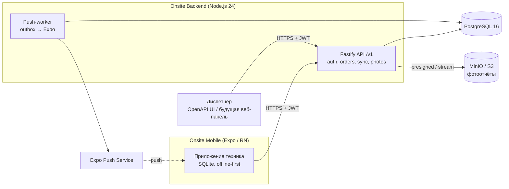
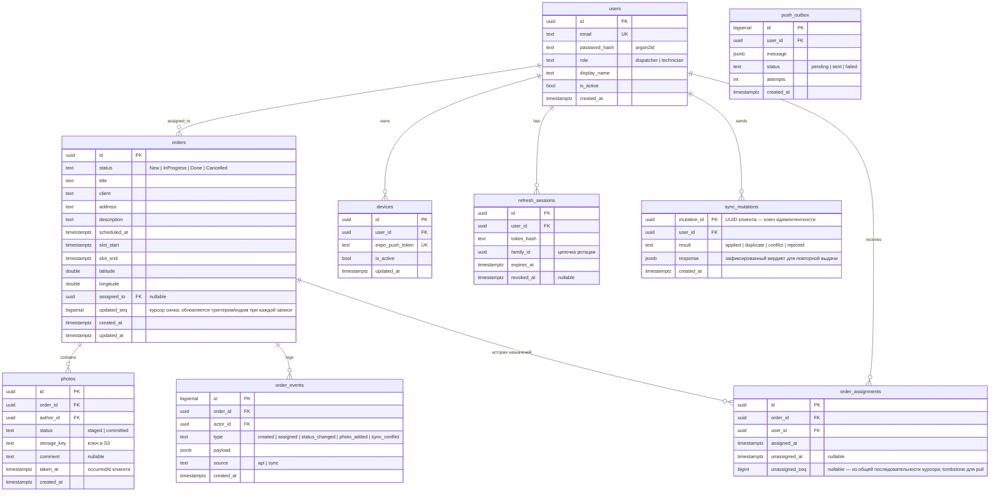

[К README](../README.ru.md) · [PDR →](pdr.md)

# Спецификация: Onsite Backend

| Поле   | Значение   |
| ------ | ---------- |
| Версия | 0.3        |
| Дата   | 2026-07-06 |
| Автор  | Dmitriy    |
| Статус | Draft      |

## 1. Введение

### 1.1 Назначение документа

Документ описывает функциональные и нефункциональные требования к бэкенду Onsite — серверной части мобильного mini-CRM для выездных сервисных работников. Читатели: разработчик проекта (solo), ревьюеры портфолио. Мобильный клиент (Expo / React Native) уже реализован и работает полностью офлайн на локальной SQLite; бэкенд превращает продукт в мультипользовательскую CRM: диспетчер создаёт и назначает заявки, техники работают offline-first и синхронизируют статусы и фотоотчёты.

### 1.2 Глоссарий

| Термин               | Определение                                                                                                                      |
| -------------------- | -------------------------------------------------------------------------------------------------------------------------------- |
| Заявка (order)       | Единица работы техника: клиент, адрес, описание, время визита, статус, фотоотчёт. Соответствует `IServiceOrder` клиента.         |
| Техник               | Выездной работник; исполняет назначенные заявки в мобильном приложении.                                                          |
| Диспетчер            | Создаёт заявки, назначает их техникам, отменяет и переназначает.                                                                 |
| Offline-first        | Клиент полноценно работает без сети; изменения накапливаются локально и досылаются при появлении соединения.                     |
| Мутация              | Атомарное изменение, произведённое клиентом офлайн (переход статуса, добавление фото), досылаемое на сервер при синхронизации.   |
| Идемпотентность      | Повторная доставка той же мутации (ретрай после обрыва сети) не создаёт дубликатов; обеспечивается клиентским UUID мутации.      |
| Курсор синхронизации | Монотонный серверный счётчик изменений (`updated_seq`); клиент запрашивает «всё, что изменилось после курсора N».                |
| Server-authoritative | При конфликте истиной считается состояние сервера; клиентская мутация отклоняется с объяснимой причиной, а не «побеждает молча». |
| Expo Push            | Сервис push-уведомлений Expo; сервер шлёт уведомления по `ExpoPushToken` устройств.                                              |

### 1.3 Контекст и цели бизнеса

- **Проблема:** приложение Onsite работает на мок-данных одного пользователя; нет источника заявок, нет ролей, прогресс техника не виден никому, кроме него самого.
- **Цели (SMART):**
  1. К вехе MVP техник получает назначенные заявки с сервера и досылает статусы/фото при появлении сети — без потери ни одной офлайн-мутации (подтверждается интеграционным тестом обрыва сети).
  2. К вехе v1.0 диспетчер управляет полным жизненным циклом заявки через API, а техник получает push о новой назначенной заявке ≤ 30 с после назначения.
  3. Бэкенд демонстрирует production-практики уровня портфолио: OpenAPI, миграции, тесты, Docker, наблюдаемость.
- **Метрики успеха (KPI):** 0 потерянных мутаций в e2e-сценарии «офлайн-смена» (50+ мутаций, 3 обрыва); p95 API ≤ 200 мс; покрытие домена (переходы статусов, синк-протокол) юнит- и интеграционными тестами ≥ 80 %.

### 1.4 Целевая аудитория и роли

| Роль                     | Описание                                                                 | Ключевые задачи                                                                                                   |
| ------------------------ | ------------------------------------------------------------------------ | ----------------------------------------------------------------------------------------------------------------- |
| Техник (`technician`)    | Пользователь мобильного приложения                                       | Получать назначенные заявки, менять статус, прикладывать фото с комментариями, синхронизироваться offline-first   |
| Диспетчер (`dispatcher`) | Оператор; в MVP работает через API/OpenAPI-консоль, веб-панель вне scope | Создавать/редактировать заявки, назначать и переназначать техников, отменять заявки, видеть прогресс и фотоотчёты |
| Система (Expo Push)      | Внешний сервис                                                           | Доставка push-уведомлений на устройства техников                                                                  |

## 2. Описание продукта

### 2.1 Краткое описание

Onsite Backend — REST API на Node.js, дающее мобильному mini-CRM Onsite мультипользовательский режим: аутентификация с ролями, серверный реестр заявок с назначением на техников, протокол офлайн-синхронизации с идемпотентными мутациями и курсором изменений, хранилище фотоотчётов и push-уведомления о назначениях.

### 2.2 Границы проекта

**In scope:**

- REST API `/v1`: аутентификация (JWT + refresh-ротация), пользователи и роли, CRUD заявок, назначение, переходы статусов с серверной валидацией конечного автомата, фотоотчёты (бинарники + метаданные), протокол синхронизации (pull по курсору / push мутаций), регистрация устройств и Expo-push.
- PostgreSQL: схема, миграции, сид демо-данных (совместимых с текущими мок-заявками клиента).
- S3-совместимое хранилище фото (MinIO в dev/self-host).
- OpenAPI-спецификация, генерируемая из кода; Docker Compose для локального запуска (API + PostgreSQL + MinIO).
- Наблюдаемость: структурные логи, `/health`, базовые метрики.

**Out of scope:**

- Веб-панель диспетчера (UI) — только API под неё.
- Доработка мобильного клиента под синхронизацию (отдельная спецификация/фаза; см. §9).
- Отчётность и аналитика (агрегаты по техникам, экспорт) — кандидат на v1.1.
- Биллинг, мультитенантность (несколько организаций), чат, геотрекинг маршрутов.
- Самостоятельная регистрация пользователей (аккаунты создаёт диспетчер/сид).

### 2.3 Ключевые сценарии (User Stories)

- **US-01:** Как диспетчер, я хочу создать заявку и назначить её технику, чтобы работа попала в его список.
- **US-02:** Как техник, я хочу при запуске приложения получить все назначенные мне заявки и дальнейшие их изменения, чтобы видеть актуальный план смены.
- **US-03:** Как техник, я хочу, чтобы статусы и фото, проставленные за смену без сети, досылались автоматически и ровно один раз, чтобы не терять и не дублировать отчётность.
- **US-04:** Как техник, я хочу получать push о новой назначенной заявке, чтобы не проверять список вручную.
- **US-05:** Как диспетчер, я хочу видеть текущий статус и фотоотчёт по заявке, чтобы контролировать исполнение.
- **US-06:** Как диспетчер, я хочу отменить или переназначить заявку, чтобы реагировать на изменения у клиента, — а техник, уже начавший работу офлайн, должен получить объяснимый конфликт, а не молчаливую потерю своего прогресса.
- **US-07:** Как разработчик, я хочу поднять весь стек одной командой и читать OpenAPI, чтобы интеграция клиента не требовала чтения серверного кода.

## 3. Функциональные требования

| ID    | Название                       | Описание                                                                                                                                                                                                                                                               | Приоритет | Критерий приёмки                                                                                                                                                                                     |
| ----- | ------------------------------ | ---------------------------------------------------------------------------------------------------------------------------------------------------------------------------------------------------------------------------------------------------------------------- | --------- | ---------------------------------------------------------------------------------------------------------------------------------------------------------------------------------------------------- |
| FR-01 | Аутентификация по email/паролю | `POST /v1/auth/login` выдаёт пару access (JWT, TTL 15 мин) + refresh (TTL 30 дней, httpOnly не требуется — мобильный клиент, хранение в SecureStore)                                                                                                                   | Must      | Логин с верными данными → 200 и пара токенов; неверный пароль → 401 без раскрытия, существует ли email; 5 неудач подряд → 429 на 15 мин                                                              |
| FR-02 | Ротация refresh-токенов        | `POST /v1/auth/refresh` меняет пару целиком; повторное использование погашенного refresh инвалидирует всю цепочку сессии                                                                                                                                               | Must      | Повторный refresh тем же токеном → 401 и отзыв сессии (тест на replay)                                                                                                                               |
| FR-03 | Роли и авторизация             | Каждый эндпойнт декларирует роль; техник видит только свои заявки, диспетчер — все                                                                                                                                                                                     | Must      | Техник запрашивает чужую заявку → 404 (не 403, без раскрытия существования); диспетчерские эндпойнты под ролью `technician` → 403                                                                    |
| FR-04 | Управление пользователями      | Диспетчер создаёт/деактивирует аккаунты техников и сбрасывает пароль (`POST/PATCH /v1/users`); сброс пароля отзывает все refresh-сессии пользователя; первый диспетчер — из сида                                                                                                                                                                  | Must      | Созданный техник логинится; деактивированный получает 401 на любой запрос ≤ TTL access-токена после деактивации; после сброса пароля прежний refresh-токен → 401                                                                                      |
| FR-05 | CRUD заявок                    | Диспетчер создаёт/читает/редактирует заявки: title, client, address, description, scheduledAt, scheduledSlot (start/end), latitude/longitude                                                                                                                           | Must      | Создание с валидными данными → 201 с телом заявки; невалидные координаты/пустой title → 422 со списком полей                                                                                         |
| FR-06 | Назначение заявки              | `POST /v1/orders/:id/assign` назначает/переназначает техника; допустимо только для статусов New/InProgress                                                                                                                                                             | Must      | Назначение на несуществующего/деактивированного техника → 422; назначение заявки в Done/Cancelled → 409                                                                                              |
| FR-07 | Конечный автомат статусов      | Сервер валидирует переходы: New→InProgress, InProgress→Done, New/InProgress→Cancelled; из Done/Cancelled переходов нет (зеркало клиентских guard'ов)                                                                                                                   | Must      | Каждый недопустимый переход → 409 с кодом `invalid_transition` и текущим статусом в теле; матрица переходов покрыта юнит-тестами полностью                                                           |
| FR-08 | Pull-синхронизация по курсору  | `GET /v1/sync/orders?cursor=N&limit=M` возвращает заявки техника (с метаданными фото, без бинарников), изменённые после курсора, включая переназначенные с него — как tombstone `unassigned` по истории назначений `order_assignments` (§5.5); `nextCursor`, `hasMore`                                                                                      | Must      | Два последовательных pull без изменений между ними → второй пуст; изменение заявки между pull'ами приходит ровно один раз; пагинация: 500 изменений при limit=200 вычитываются за 3 запроса          |
| FR-09 | Push офлайн-мутаций            | `POST /v1/sync/mutations` принимает батч мутаций `{mutationId (UUID клиента), type: status_change | photo_add, orderId, payload, baseStatus, occurredAt}`; для `photo_add` payload ссылается на `photoId` staged-загрузки (фаза 1 — FR-11); ответ — повёрстный результат: `applied` / `duplicate` / `conflict` / `rejected` с кодом причины             | Must      | Повторная отправка того же батча (ретрай) → все `duplicate`, состояние БД не меняется (тест идемпотентности); батч применяется атомарно повёрстно — сбой одной мутации не блокирует остальные; `photo_add` с неизвестным/чужим `photoId` → `rejected`        |
| FR-10 | Разрешение конфликтов          | Server-authoritative: мутация со статусным переходом, невалидным против текущего серверного состояния (заявка отменена диспетчером, переназначена), получает `conflict` с актуальным снимком заявки; фото к отменённой заявке принимается (фотоотчёт ценен постфактум) | Must      | Сценарий US-06 покрыт интеграционным тестом: техник офлайн ставит Done, диспетчер отменяет → мутация `conflict`, клиенту возвращён снимок со статусом Cancelled; `photo_add` к Cancelled → `applied` |
| FR-11 | Загрузка фото                  | Фаза 1 фото-синка: `POST /v1/orders/:id/photos` (multipart, ≤ 10 МБ, JPEG/PNG/WebP) с заголовком `Idempotency-Key`; сервер кладёт бинарник в S3-хранилище, метаданные (comment, takenAt, автор) в БД как `staged`-запись; видимым фото становится после коммита мутацией `photo_add` (FR-09); staged-записи без коммита старше 7 суток зачищаются фоново вместе с бинарником                                                                                    | Must      | Повторная загрузка с тем же ключом → 200 с той же записью, второй файл не создаётся; 11 МБ → 413; PDF → 415; staged-фото не видно в `GET /v1/orders/:id` и pull до коммита                                                                                          |
| FR-12 | Выдача фото                    | `GET /v1/photos/:id/file` — 302-редирект на presigned URL (TTL 10 мин); доступ по тем же правилам, что и к заявке                                                                                                                                               | Must      | Presigned URL истекает через ≤ 10 мин (проверка по 403 после истечения); чужое фото → 404                                                                                                            |
| FR-13 | Регистрация устройств          | `PUT /v1/devices` сохраняет `expoPushToken` устройства пользователя; повторная регистрация того же токена — upsert                                                                                                                                                     | Must (v1.0) | Два устройства одного техника получают push оба; токен, отвергнутый Expo как `DeviceNotRegistered`, деактивируется автоматически                                                                     |
| FR-14 | Push о назначении              | Назначение заявки на техника инициирует Expo-push (тайтл заявки, время визита) на все активные устройства техника                                                                                                                                                      | Should    | Push поставлен в очередь ≤ 5 с после назначения; недоставка Expo логируется и не ломает сам запрос назначения (outbox-паттерн или at-least-once очередь)                                             |
| FR-15 | История событий заявки         | Каждое изменение (создание, назначение, переход, фото, конфликт) пишется в append-only `order_events` с актором и источником (api/sync)                                                                                                                                | Must      | По любой заявке из e2e-теста восстанавливается полная хронология; события не редактируются и не удаляются (нет UPDATE/DELETE-путей в коде)                                                           |
| FR-16 | Сид демо-данных                | Идемпотентная команда сида: диспетчер, 2 техника, 6 заявок, совместимых по полям с текущими мок-данными клиента (`mock.ts`)                                                                                                                                            | Must      | Повторный запуск сида не создаёт дубликатов; после сида e2e-сценарий US-01…US-03 проходит без ручной подготовки                                                                                      |
| FR-17 | OpenAPI и health               | `GET /v1/health` (liveness: ok/деградация зависимостей), `GET /docs` — OpenAPI UI, спека генерируется из схем валидации                                                                                                                                                | Must      | Спека валидна (openapi-валидатор в CI); `/health` отвечает ≤ 100 мс и не требует аутентификации                                                                                                      |
| FR-18 | Rate limiting                  | Глобальный лимит на IP + отдельный жёсткий на `/v1/auth/*`                                                                                                                                                                                                             | Should    | 100+ RPS с одного IP на `/v1/auth/login` → 429; легитимный синк-батч (1 запрос с 500 мутациями) лимитом не задевается                                                                                |

## 4. Нефункциональные требования

| ID     | Категория          | Требование                    | Метрика                                                                                                                                                                             |
| ------ | ------------------ | ----------------------------- | ----------------------------------------------------------------------------------------------------------------------------------------------------------------------------------- |
| NFR-01 | Производительность | Латентность CRUD и pull-синка | p95 ≤ 200 мс, p99 ≤ 500 мс при 50 RPS (профиль: 20 техников × активная смена)                                                                                                       |
| NFR-02 | Производительность | Приём синк-батча              | Батч из 500 мутаций обрабатывается ≤ 1 с; загрузка фото 5 МБ ≤ 3 с на локальной сети                                                                                                |
| NFR-03 | Надёжность         | Доступность и восстановление  | Uptime ≥ 99.5 % (portfolio/self-host); RPO ≤ 24 ч (ежедневный pg_dump + бэкап bucket'а), RTO ≤ 4 ч; офлайн-клиент делает недоступность API некритичной для полевой работы           |
| NFR-04 | Надёжность         | Целостность синхронизации     | 0 потерянных и 0 задублированных мутаций в e2e-тесте с 3 обрывами сети посреди батча                                                                                                |
| NFR-05 | Безопасность       | Хранение секретов и паролей   | Пароли — argon2id; JWT — RS256 (пара ключей; приватный — только в секретах API, публичный сможет верифицировать будущая веб-панель/BFF); секреты вне git; `.env.example` без значений                                                                    |
| NFR-06 | Безопасность       | Транспорт и поверхность атаки | TLS обязателен (терминация на reverse-proxy); helmet-заголовки; валидация 100 % входных схем (запрос без схемы не компилируется/не регистрируется); OWASP API Top-10 чек перед v1.0 |
| NFR-07 | Безопасность       | Персональные данные           | Имена/адреса клиентов в системе — демо-данные, не реальные ПДн (решение §9.1); доступ всё равно только аутентифицированным ролям, логи не содержат тел запросов — гигиена сохраняется на случай перехода на реальные данные          |
| NFR-08 | Масштабируемость   | Горизонтальный рост           | API stateless (сессии — в БД/токенах): 2+ инстанса за балансировщиком без изменения кода; курсор синка — глобальный `bigserial`, безопасный при конкурентных записях (см. §5.5)     |
| NFR-09 | Совместимость      | Версии платформы              | Node.js 24 LTS; PostgreSQL 16; S3 API v4 (MinIO/совместимые); контракт `/v1` стабилен — ломающие изменения только через `/v2`                                                       |
| NFR-10 | Локализация        | Сообщения об ошибках          | Машиночитаемые коды ошибок (`invalid_transition`, `conflict`) — английские константы; человекочитаемые тексты формирует клиент; даты — только ISO 8601 UTC                          |
| NFR-11 | Наблюдаемость      | Логи и метрики                | Структурные JSON-логи (pino) с requestId; уровни dev/prod; `/metrics` Prometheus (латентности, коды, глубина outbox); алёрт-порог: доля 5xx &gt; 1 % за 5 мин                       |
| NFR-12 | Сопровождаемость   | Качество кода                 | TypeScript strict без `any`; ESLint + Prettier в CI; миграции только вперёд, через инструмент ORM; покрытие домена тестами ≥ 80 % (см. KPI)                                         |

## 5. Архитектура

### 5.1 Высокоуровневая диаграмма

### 5.2 Компоненты

| Компонент         | Ответственность                                                                               | Технологии                                                |
| ----------------- | --------------------------------------------------------------------------------------------- | --------------------------------------------------------- |
| HTTP API          | Роутинг, схемная валидация, аутентификация/авторизация, генерация OpenAPI                     | Fastify 5, TypeBox-схемы                                  |
| Домен заявок      | Конечный автомат статусов, правила назначения — чистые функции, зеркалящие клиентские guard'ы | TypeScript, без зависимостей                              |
| Синк-протокол     | Курсорный pull, идемпотентный приём мутаций, вердикты конфликтов                              | Модуль поверх домена + таблица `sync_mutations`           |
| Хранилище фото    | Приём multipart (staged-записи), выдача presigned URL, лимиты типов/размеров, зачистка непривязанных staged-загрузок | `@aws-sdk/client-s3` (MinIO-совместимо)                   |
| Push-worker       | Чтение outbox-таблицы, отправка чанками в Expo, обработка receipt'ов и мёртвых токенов        | `expo-server-sdk`, polling-worker в том же процессе (MVP) |
| Данные и миграции | Схема БД, миграции, сид                                                                       | Drizzle ORM + drizzle-kit                                 |
| Инфраструктура    | Локальный стек одной командой, CI                                                             | Docker Compose (api, postgres, minio), GitHub Actions     |

### 5.3 Стек и обоснование

- **Runtime:** Node.js LTS — задан ограничением проекта; единый язык с клиентом (TypeScript strict, те же конвенции PDR §6: `I`-префикс интерфейсов, const-object enum).
- **Framework:** Fastify 5 — schema-first валидация (TypeBox) с бесплатной генерацией OpenAPI, лучшая среди мейнстрим-фреймворков производительность, минимум магии — соответствует принципу проекта «практичная ясность». NestJS отклонён как избыточный для solo-объёма; Express — как не даёт schema-first из коробки.
- **БД:** PostgreSQL 16 — транзакционность для синк-батчей, `bigserial` для курсора, JSONB для payload'ов событий.
- **ORM:** Drizzle — SQL-близкий, строгая типизация схемы, лёгкие миграции; не прячет транзакции (критично для FR-09).
- **Хранилище файлов:** S3-протокол (MinIO в dev/self-host) — presigned URL снимают трафик фото с API-процесса.
- **Push:** `expo-server-sdk` — клиент уже на Expo, токены `ExpoPushToken` доступны без нативной работы с FCM/APNs.
- **Инфраструктура:** Docker Compose; CI — GitHub Actions (конвенции CI заданы мобильным репо: SHA-пиновка, минимальные permissions). Отдельный репозиторий; модель ветвления — trunk-based `main` без gitflow (в мобильном репо gitflow существует ради маршрутизации доставки OTA/APK — бэкенду это не нужно); версию, CHANGELOG, тег и Docker-образ формирует semantic-release из Conventional Commits.

### 5.4 Интеграции

| Сервис            | Назначение                           | Протокол                                                | Owner              |
| ----------------- | ------------------------------------ | ------------------------------------------------------- | ------------------ |
| Expo Push Service | Доставка push на устройства техников | HTTPS (`exp.host/--/api/v2/push`) через expo-server-sdk | Expo (внешний)     |
| MinIO / S3        | Хранение бинарников фотоотчётов      | S3 API v4                                               | Проект (self-host) |
| PostgreSQL        | Основное хранилище                   | TCP/5432                                                | Проект (self-host) |

### 5.5 Модель данных

Соответствие клиентской модели: `IServiceOrder.scheduledTime`/`scheduledSlot` (строки «09:00», «12:00 — 13:00») — производные представления; сервер хранит канонические `scheduled_at`/`slot_start`/`slot_end` (timestamptz), клиент форматирует локально. `IServiceOrderPhoto.uri` на клиенте остаётся локальным файлом; серверный `photos.id` связывает локальную запись с загруженным бинарником.

Замечание к курсору (NFR-08): `updated_seq` присваивается из общей последовательности при каждой записи заявки; чтобы pull не пропускал строки незакоммиченных транзакций с меньшим seq, выдача ограничивается `updated_seq <= pg_snapshot_xmin`-безопасной границей либо `nextCursor = max(seq) - safety_lag` с повторной выдачей хвоста (допустимо: pull идемпотентен по «last write wins» на клиенте).

Tombstone переназначения (FR-08): по `orders.assigned_to` нельзя вычислить, кому заявка была видна раньше, поэтому история назначений хранится в `order_assignments`; при снятии/переназначении строка бывшего исполнителя получает `unassigned_seq` из той же последовательности, что и `updated_seq`, и его pull отдаёт tombstone `unassigned` по условию `unassigned_seq > cursor`.

### 5.6 API-контракт

Версионирование: префикс `/v1`, JSON UTF-8, даты ISO 8601 UTC. Аутентификация: `Authorization: Bearer <access>` везде, кроме `/v1/auth/login`, `/v1/auth/refresh`, `/v1/health`. Ошибки — единый конверт `{ code, message, details? }`.

| Метод | Путь                      | Описание                                                                             | Запрос                                 | Ответ                                           | Ошибки                        |
| ----- | ------------------------- | ------------------------------------------------------------------------------------ | -------------------------------------- | ----------------------------------------------- | ----------------------------- |
| POST  | /v1/auth/login            | Логин                                                                                | `{email, password}`                    | 200 `{access, refresh, user}`                   | 401, 429                      |
| POST  | /v1/auth/refresh          | Ротация пары токенов                                                                 | `{refresh}`                            | 200 `{access, refresh}`                         | 401 (replay → отзыв семьи)    |
| POST  | /v1/auth/logout           | Отзыв сессии                                                                         | `{refresh}`                            | 204                                             | 401                           |
| POST  | /v1/users                 | Создать техника (dispatcher)                                                         | `{email, password, displayName, role}` | 201 user                                        | 403, 409 (email), 422         |
| PATCH | /v1/users/:id             | Активация/деактивация, имя, сброс пароля (dispatcher)                                | частичный user                         | 200 user                                        | 403, 404, 422                 |
| GET   | /v1/orders                | Список: dispatcher — все (+фильтры status, assignedTo, пагинация), technician — свои | query                                  | 200 `{items, nextCursor}`                       | 401                           |
| POST  | /v1/orders                | Создать заявку (dispatcher)                                                          | тело заявки                            | 201 order                                       | 403, 422                      |
| GET   | /v1/orders/:id            | Заявка с фото и событиями                                                            | —                                      | 200 order                                       | 404                           |
| PATCH | /v1/orders/:id            | Правка полей (dispatcher; статус — только через transition)                          | частичное тело                         | 200 order                                       | 403, 404, 409, 422            |
| POST  | /v1/orders/:id/assign     | Назначить/переназначить (dispatcher)                                                 | `{technicianId}`                       | 200 order                                       | 403, 404, 409, 422            |
| POST  | /v1/orders/:id/transition | Переход статуса онлайн                                                               | `{to, baseStatus}`                     | 200 order                                       | 404, 409 `invalid_transition` |
| POST  | /v1/orders/:id/photos     | Фаза 1 фото-синка: staged-загрузка (multipart + `Idempotency-Key`)                   | file, comment?, takenAt                | 201 photo (staged)                              | 404, 409, 413, 415, 422       |
| GET   | /v1/photos/:id/file       | Бинарник фото                                                                        | —                                      | 302 → presigned URL                             | 404                           |
| GET   | /v1/sync/orders           | Pull изменений по курсору (technician)                                               | `?cursor&limit≤500`                    | 200 `{items, nextCursor, hasMore}`              | 401, 422                      |
| POST  | /v1/sync/mutations        | Push батча офлайн-мутаций (technician)                                               | `{mutations: [...] ≤500}`              | 200 `{results: [{mutationId, result, order?}]}` | 401, 422 (схема батча)        |
| PUT   | /v1/devices               | Регистрация push-токена устройства                                                   | `{expoPushToken}`                      | 204                                             | 401, 422                      |
| GET   | /v1/health                | Liveness + статус зависимостей                                                       | —                                      | 200 `{status, deps}`                            | —                             |
| GET   | /metrics                  | Prometheus-метрики (внутренняя сеть)                                                 | —                                      | 200 text                                        | —                             |

Семантика `POST /v1/sync/mutations` (FR-09/FR-10): каждая мутация обрабатывается в собственной транзакции: проверка идемпотентности по `mutation_id` → валидация переходов против текущего серверного статуса → применение + `order_events` + инкремент `updated_seq` → фиксация вердикта в `sync_mutations`. Ответ повторного запроса собирается из зафиксированных вердиктов — байт-в-байт тот же результат.

Мутация `photo_add` — фаза 2 фото-синка: коммитит staged-фото (фаза 1 — FR-11) по `photoId` из payload — переводит запись в `committed`, пишет `photo_added` в `order_events` и инкрементит `updated_seq` заявки; неизвестный, чужой или уже закоммиченный `photoId` → `rejected` (повтор того же `mutationId` → `duplicate`).

## 6. UI/UX

Бэкенд UI не имеет. Точки соприкосновения:

- OpenAPI UI (`/docs`) — рабочий инструмент диспетчера в MVP и контракт для будущей веб-панели.
- Мобильный клиент: экраны не меняются; появляются состояния синхронизации (индикатор «не отправлено», конфликтный тост) — фиксируются в отдельной спецификации клиентской интеграции (§9, вопрос 4).

## 7. План релизов

| Веха             | Содержание                                                                                                                                       | Дата |
| ---------------- | ------------------------------------------------------------------------------------------------------------------------------------------------ | ---- |
| M0 — скелет      | Репозиторий (trunk-based `main` + semantic-release), Fastify + Drizzle + Compose (api/pg/minio), CI (lint, typecheck, test), `/health`, OpenAPI, миграции, сид (FR-16, FR-17) | —    |
| MVP              | Auth + роли (FR-01…FR-04), заявки и автомат статусов (FR-05…FR-07), синк-протокол (FR-08…FR-10), фото (FR-11, FR-12), история событий (FR-15); e2e «офлайн-смена» зелёный | —    |
| v1.0             | Push (FR-13, FR-14, outbox-worker), rate limiting (FR-18), метрики/алёрты (NFR-11), OWASP-чек, деплой self-host                 | —    |
| v1.1 (кандидаты) | API отчётности для веб-панели (агрегаты по техникам, экспорт), soft-delete и архив заявок, мультиорганизация, retention-policy фотоотчётов (авто-удаление по возрасту)                                     | —    |

Даты не проставлены намеренно: проект портфолио, оценки сроков вне scope документа.

## 8. Риски и допущения

| Риск                                                                                                                 | Вероятность | Влияние                                                           | Митигирование                                                                                                                                                                     |
| -------------------------------------------------------------------------------------------------------------------- | ----------- | ----------------------------------------------------------------- | --------------------------------------------------------------------------------------------------------------------------------------------------------------------------------- |
| Синк-протокол сложнее, чем кажется: пропуски по курсору при конкурентных транзакциях, двойное применение при ретраях | Средняя     | Высокое — потеря доверия к отчётности                             | Идемпотентность по `mutation_id` с фиксацией вердикта; safety-lag курсора (§5.5); e2e-тест обрывов сети как обязательный критерий MVP (NFR-04)                                    |
| Расхождение доменной логики клиента и сервера (guard'ы статусов реализованы дважды)                                  | Средняя     | Среднее — «валидный» офлайн-переход отклоняется сервером          | Матрица переходов — единственный источник в виде таблицы в обеих кодовых базах, полное покрытие юнит-тестами с обеих сторон; конфликт возвращает снимок для самокоррекции клиента |
| Рост хранилища фото (0.5–2 МБ × десятки в смену)                                                                     | Высокая     | Среднее — стоимость/бэкапы self-host                              | Лимит 10 МБ на файл; клиент уже сжимает (quality 0.7); retention не реализуется в MVP/v1.0 (хранение бессрочно), кандидат v1.1 при росте объёма (решение §9.3)                                                                                     |
| Надёжность Expo Push (receipt'ы, мёртвые токены)                                                                     | Средняя     | Низкое — push вспомогателен, список заявок синхронизируется и так | Outbox + обработка receipt'ов, автодеактивация `DeviceNotRegistered`; push не в критическом пути назначения                                                                       |
| Solo-разработчик: объём MVP (18 FR) растянется                                                                       | Высокая     | Среднее                                                           | Жёсткий out of scope (§2.2), веха M0 как каркас, отчётность вынесена в v1.1                                                                                                       |

**Допущения:**

- Стек выбран исполнителем в рамках ограничения «Node.js»: Fastify 5 + TypeScript strict + PostgreSQL 16 + Drizzle + MinIO (обоснование в §5.3); заказчик ограничил только runtime.
- Одна организация, без мультитенантности; аккаунты создаёт диспетчер, self-signup отсутствует.
- Диспетчер в MVP работает через OpenAPI UI; веб-панель — отдельный будущий проект.
- Хостинг — self-host (VPS + Docker Compose); управляемые облачные сервисы не закладываются.
- Демо-данные и объёмы — портфолио-масштаб (≤ 50 техников, ≤ 10 тыс. заявок); NFR калиброваны под него.
- Мобильный клиент будет доработан под синк-протокол отдельной фазой; текущая локальная SQLite-схема остаётся его внутренним делом.
- Репозиторий бэкенда — отдельный, папка-сосед мобильного; лицензия — PolyForm Noncommercial 1.0.0 (как у клиента); коммиты — Conventional Commits, тип английский, описание русское (конвенция мобильного репо).

## 9. Решённые вопросы

Открытые вопросы версии 0.1 закрыты решениями 9.1–9.5, вопросы ревизии 0.2 — решениями 9.6–9.9. Все решения приняты 2026-07-06.

- [x] **9.1 Юрисдикция и ПДн.** Система работает только с демо-данными, реальные ПДн клиентов не хранятся. 152-ФЗ формально неприменим, требование к юрисдикции хостинга снято; NFR-07 сохраняется как гигиена (ролевой доступ, логи без тел запросов) на случай будущего перехода на реальные данные.
- [x] **9.2 Создание заявок техником.** Не реализуется — заявки создаёт только диспетчер, FR-05 без изменений.
- [x] **9.3 Retention фотоотчётов.** В MVP/v1.0 — хранение бессрочно, retention-policy не реализуется. Задел на будущее внесён в §7 как кандидат v1.1 (авто-удаление по возрасту после закрытия заявки).
- [x] **9.4 Клиентская интеграция.** Подтверждена на ближайшую фазу после бэкенда: мобильный клиент заменит локальный сид на серверные данные — приоритет tombstone-семантики FR-08 подтверждён высоким уже для MVP. Клиент будет использовать TanStack Query поверх HTTP-клиента (axios предпочтителен) для кеширования/инвалидации — курсорный pull (FR-08) хорошо ложится на паттерн query-invalidation, дополнительных требований к API-контракту это не добавляет.
- [x] **9.5 Просмотр событий диспетчером (FR-15).** Нужен уже в MVP: приоритет FR-15 повышен до Must, включён в веху MVP (§7); контракт `GET /v1/orders/:id` уже возвращал события (§5.6) — несогласованность с прежним статусом "Should" устранена.
- [x] **9.6 Фото офлайн-синка (противоречие FR-09 ↔ FR-11).** Бинарник не может ехать в JSON-батче мутаций; принята двухфазная схема: фаза 1 — multipart-загрузка (`Idempotency-Key`) создаёт `staged`-запись, фаза 2 — мутация `photo_add` в батче `/v1/sync/mutations` коммитит фото по `photoId`. Единый журнал мутаций сохраняет порядок событий смены; staged-сироты старше 7 суток зачищаются фоново (FR-09, FR-11, §5.6).
- [x] **9.7 Алгоритм JWT.** RS256: приватный ключ — только у API, публичный позволит будущей веб-панели/BFF верифицировать токены без общего секрета (NFR-05).
- [x] **9.8 Сброс пароля.** В scope MVP: диспетчер сбрасывает пароль через `PATCH /v1/users/:id`, сброс отзывает все refresh-сессии пользователя (FR-04). Self-service восстановление (email-флоу) — вне scope.
- [x] **9.9 Версионирование и релизы бэкенда.** Trunk-based `main` + semantic-release (версия из Conventional Commits, CHANGELOG, тег, Docker-образ). Gitflow не переносится: в мобильном репо он существует ради маршрутизации доставки OTA/APK (§5.3, §7).

Дополнительно в 0.3 без отдельного обсуждения: Node.js 22 → 24 LTS (актуальный active LTS); механизм tombstone через `order_assignments` (§5.5); метаданные фото в pull (FR-08); FR-12 зафиксирован как 302-редирект (вариант «стрим» убран — контракт §5.6 и так задавал 302); приоритет FR-13 — Must (v1.0); лицензия и конвенции коммитов — в допущениях (§8).

## 10. Приложения

- Мобильный клиент (репозиторий [field-service-crm](https://github.com/ZaycevDmitriy/field-service-crm)): PDR v2 приложения, доменные типы — `src/entities/order/model/types.ts`, конечный автомат — `src/entities/order/model/order-status.ts`.
- Аудит мобильного приложения от 2026-07-02 (в репозитории мобильного клиента; находки H1/M1/M4 мотивируют server-authoritative валидацию переходов).
- Expo Push API: [https://docs.expo.dev/push-notifications/sending-notifications/](https://docs.expo.dev/push-notifications/sending-notifications/)
- Референс идемпотентности HTTP: IETF draft-ietf-httpapi-idempotency-key-header.

## Смежные страницы

- [PDR](pdr.md) — цели, задачи, риски и график проекта по этой спецификации.
- [Фазы реализации](implementation-phases.md) — разбивка задач PDR на 6 фаз.
- [Аудит OWASP API Top 10](security-audit-owasp-api-top10.md) — проверка NFR-05/NFR-06 перед v1.0.

